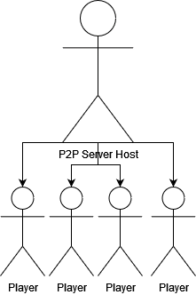

# P2P Game Abuse

P2P is a networking solution used in games where client machines communicate directly to eachother to create a "decentralized" and "cost effective" game server.

A Dedicated server has to be paid for by the creator of the game and communicates to all clients and is more complicated to setup.

Many game developers today decide it makes more sense to use P2P for their games due to the mentioned pros. All the clients connect to one centralized host which is another player.

P2P Server            |  Dedicated Server
:-------------------------:|:-------------------------:
  |  

The catch is if you are the host of the server your machine is communicating and sending packets directly to other players machines allowing you sniff the outgoing packets and log the contacted ip addresses.
If you are a player joining a host you can also grab the hosts ip address using the same logic.
A proof of concept python script is in the repository which uses this very same idea. It works on p2p games like Rockstar Games, Forts, and most games where you "host" a session (co-op games)
